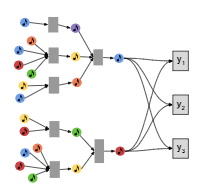

# Resreach Notes

## Notes on MUSIG

- MUSIG = **Mu**lti-task **S**ampling and **I**nductive learning on **G**raphs

### Leverages 3 sources of information
- Organizational information - Playlist co-occurrence.
- Content information - Audio & acoustic features extracted from tracks.
- Music stylistics - Musical domain characteristics like music genres.

### MUSIG derives gneralized track representations that combine the benefits offered by 
- The inductive graph based framework - Generates embeddings by sampling and aggregating features from a node's local neighborhood. 
- Multi-task training of aggregation functions - Ensures the learnt functions perform well on a number of important tasks.

### Why aggreagtor functions over Distinct Embedding Vector for Each Node?
- Ill-suited for such tasks - mismatch between the original learning and downstream task (e.g., track recommendation for playlist  completion, ranking tracks within a playlist and suggesting tracks in sequential sessions like track radios).
- Enables learning richer representations for increased adoption of the representations for a variety of newer downstream tasks.
- Trained aggregator functions afford theinductive ability to the model.

### On Music Graph Data

Let Weighted Graph, G = (V, E), where  
V = Set of Nodes; each node represents a track.  
E = Connections between tracks occuring in the same playlist.  
Edge weight - # Distinct playlists where 2 tracks co-occur; edges with weight <= 10 are excluded.  
3 sources of info (above) considered for each pair of nodes.

.

-  Learning the representations of new tracks as early as possible is crucial for production machine learning systems.
-  A good representation learning approach shouldleverage all available information, including both playlist co-occurrence and  content features.

### Algorithmic Components divided into 2 tasks
- Neighborhood Aggregator Step
- Multi-Task Supervision Step

## References

[1] Antonia Saravanou, Federico Tomasi, Rishabh Mehrotra and Mounia Lalmas, “Multi-Task Learning of Graph-based Inductive Representations of Music Content”, in Proceedings of the 22nd International Society for Music Information Retrieval Conference, Online, Nov. 2021, pp. 602–609. doi: 10.5281/zenodo.5624379.